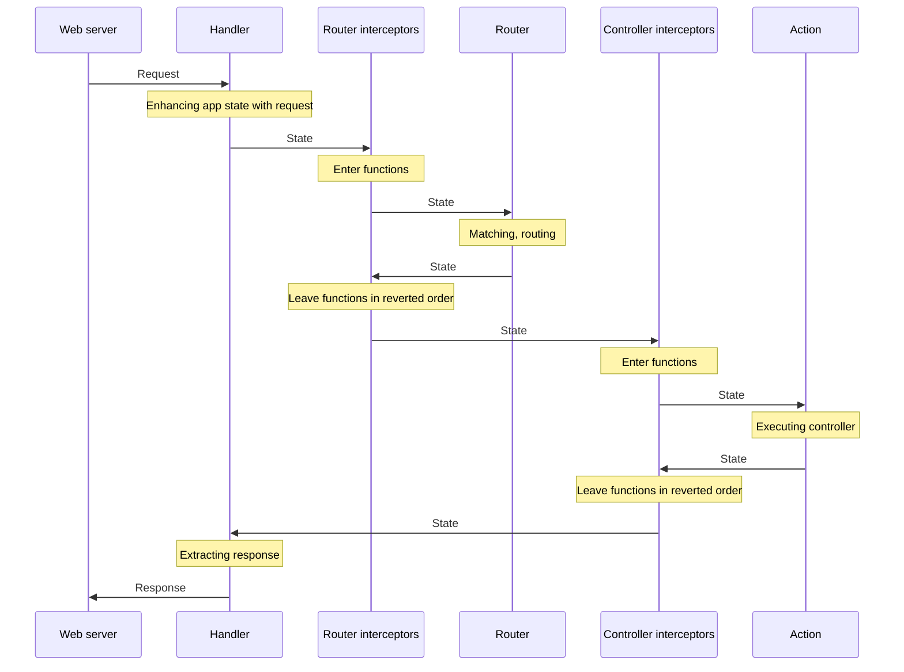
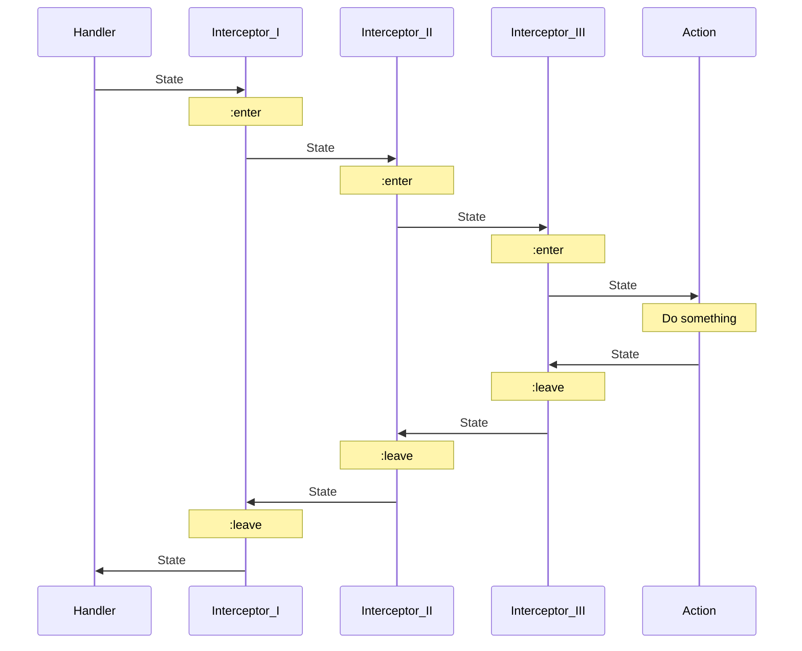
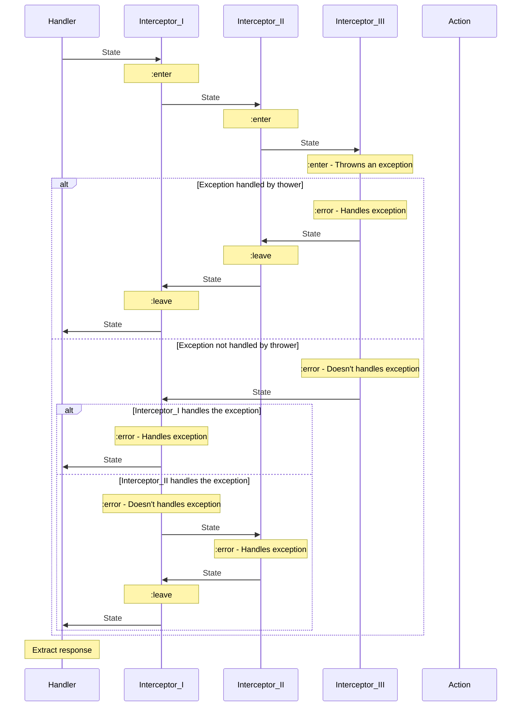

# Conventions

- [Overview](#overview)
- [State](#state)
- [Action](#action)
- [Handler](#handler)
- [Dependencies](#dependencies)
- [Interceptors](#interceptors)
- [Interceptors error handling](#interceptors-error-handling)

## Overview

The diagram bellow gives you an overview, how a request is processed in Xiana based applications.



## State

State is created for each HTTP request and represents the current state of the application. It contains:

- the application's dependencies and configuration
- request
- request-data
- response

This structure is very volatile, will be updated quite often on the application's life cycle.

The main modules that update the state are:

- Routes:

  Add information from the matched route to the state map

- Interceptors:

  Add, consumes or remove information from the state map. More details in [Interceptors](#interceptors) section.

- Actions:

  In actions, you are able to interfere with the :leave parts of the interceptors.

At the last step of execution the handler extracts the response value from the state.

The state is renewed on every request.

## Action

The action conventionally is the control point of the application flow. This is the place were you can define how the
rest of your execution flow would behave. Here you can provide the database query, restriction function, the view, and
the additional side effect functions are you want to execute.

Actions are defined in the routes vector

```clojure
["/" {:get {:action #(do something)}}]
```

## Handler

Xiana's handler creates the state for every request, matches the appropriate route, executes the interceptors, handles
interceptor overrides, and not-found cases.
It handles websocket requests too.

## Routing

Routing means selecting the actions to execute depending on the request URL, and HTTP method.

## Dependencies

Modules can depend on external resources, configurations, as well as on other modules. These dependencies are added to
the state on state creation, and defined on application startup.

## Interceptors

An interceptor is a pair of unary functions. Each function must recieve and return a state map. You can look at it as on
an analogy to AOP's around aspect, or as on a pair of middlewares. They work mostly the same way
as [pedestal](http://pedestal.io/reference/interceptors) and [sieppari](https://github.com/metosin/sieppari)
interceptors.
Xiana provides a set of base interceptors, for the most common use cases.

This figure shows how interceptors are executed ideally:



## Interceptors error handling:

The interceptor executor handles the exceptional states like sieppari does. If an exception happens, it tries to handle
first in the same interceptor. If it has and `:error` handler, it will call it, otherwise it'll search for `:error`
handlers for the beginning of the interceptor queue. When and `:error` function found, and matched with the given
exception, the executor calls the queue `:leave` functions in reserved order, where the handler has been found.

This diagram shows how the error cases handled:


