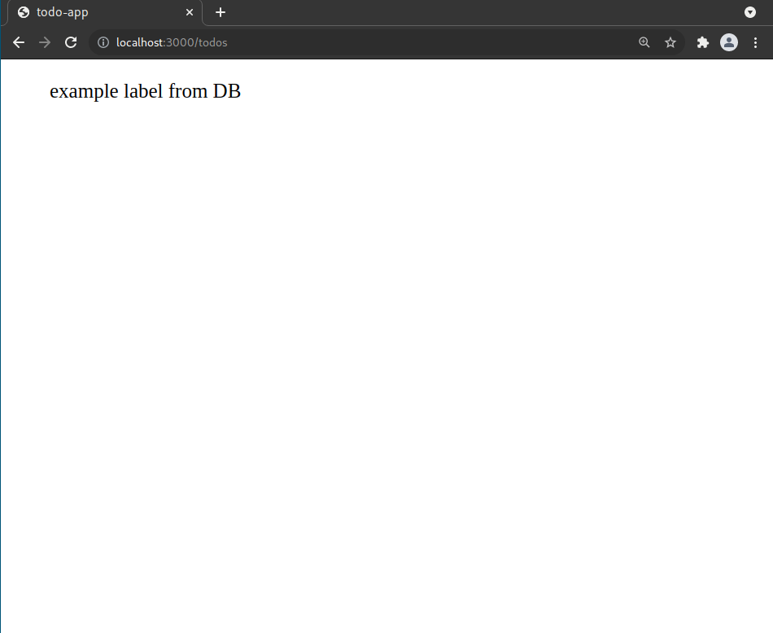

# How to make a Todo app using Xiana

## Requirements

- docker
- docker-compose

## Create a new app

### 1. Use Xiana template to create project scaffold

Run the following code in your terminal

```bash
lein new xiana todo-app
```

This will create a directory *todo-app* containing project scaffold.

### 2. Satisfy dependencies

Run the following command from the newly created project directory to fetch frontend dependencies

```bash
lein shadow npm-deps
```

### 3. Run dockerized database

You need to have docker and docker-compose installed on your machine for the following command to work. Run the
following from the root directory of your project.

```bash
docker-compose up -d
```

This should spin up a PostgreSQL database on port 5433. Name of the DB is `todo_app` You can verify that the database is
running by connecting to it. Value of `username` and `password` is *`postgres`.*

```bash
docker exec -it todo-app_db_1 psql -U postgres -d todo_app
```

which should open a PostgreSQL shell if successful.

### 4. Populate database with data

On application start, the framework will look for database migrations located in the configured location. By default,
this location is set to *resources/migrations* directory*.*

It is possible to create migrations by running from the project directory

```bash
lein migrate create todos
```

This will create two migration files inside the *resources/migrations* directory. Both file names will be prefixed by
the timestamp value of the file creation.

Put the following SQL code inside the *todos-up.sql* file

```sql
CREATE EXTENSION IF NOT EXISTS "uuid-ossp";
--;;
CREATE TABLE todos
(
    id uuid NOT NULL DEFAULT uuid_generate_v4() PRIMARY KEY,
    label varchar(2048) NOT NULL,
    done boolean NOT NULL DEFAULT false,
    created_at timestamptz NOT NULL DEFAULT now()
);

--;;

INSERT INTO todos (label) values ('example label from DB');
```

and this one into the *todos-down.sql* file.

```sql
DROP TABLE todos;
```

### 5. Start the application

1. Run Clojure REPL and load contents of file *dev/user.clj* into it.
2. Execute function *start-dev-system*
3. Your **Todo App** should now be running. You can verify it by visiting URL
   *[http://localhost:3000/re-frame](http://localhost:3000/re-frame)* in your browser.

### 6. Add endpoint to backend API

Routes definition can be found in the *src/backend/todo_app/core.clj* file. Replace the routes definition with following
code.

```clojure
(def routes
  [["/api/todos" {:action #'fetch}]])
```

define a function to be called when the endpoint is hit.

```clojure
(defn fetch
  [state]
  state)
```

Now you need to reload the changed files to REPL and restart the application by executing *start-dev-system* function
once again.
Now opening [http://localhost:3000/api/todos](http://localhost:3000/api/todos) in your browser returns a blank page.

### 7. Hello World!

Change the implementation of *fetch* function to display "Hello World!" every time our endpoint is hit.

```clojure
(defn fetch
  [state]
  (assoc state :response {:status 200
                          :body   "Hello World!"}))
```

Reload the modified function and restart the application.

### 8. Return contents of the todos table

Change the implementation of function *fetch* once again and create a new *view* function.

Function:

- *fetch* - now contains SQL query and a reference to a newly created *view* function.
- *view* - describes a transformation of the data returned from the database to the form returned by server response.

```clojure
(defn view
  [{{db-data :db-data} :response-data :as state}]
  (assoc state :response {:status 200
                          :body   (mapv :todos/label db-data)}))
(defn fetch
  [state]
  (assoc state
    :view view
    :query {:select [:*] :from [:todos]}))
```

Again, reload the modified function and restart the application.

After running following curl command from your shell, live data from your database should appear on your screen.

```clojure
curl http://localhost:3000/api/todos
```

## Create a page in the app to display data returned by the endpoint

### 1. Add frontend dependencies

Add following dependencies into *project.clj* file.

```clojure
(defproject
  ...
  :dependencies [
                 ...
                 [cljs-ajax "0.8.4"]
                 [day8.re-frame/http-fx "0.2.3"]
                 ...
                 ]
  ...
  )
```

### 2. Set initial value of re-frame database

File *src/frontend/todo_app/db.cljs* contains initial value of re-frame databse. Inside of this file replace value of *
default-db* to the following:

```clojure
(def default-db
  {:todos []})
```

### 3. Define re-frame events

Replace contents of *src/frontend/todo_app/events.cljs* file with the following code:

```clojure
(ns todo-app.events
  (:require
    [re-frame.core :as re-frame]
    [ajax.core :as ajax]
    [day8.re-frame.http-fx]
    [todo-app.db :as db]
    ))

(defn url [tail] (str "http://localhost:3000" tail))

(re-frame/reg-event-db
  ::initialize-db
  (fn [_ _]
    db/default-db))

(re-frame/reg-event-db
  ::add-todos->db
  (fn [db [_ response]]
    (assoc db :todos response)))

(re-frame/reg-event-db
  ::failure
  (fn [db _]
    (js/console.error "Something is wrong!")
    db))

(re-frame/reg-event-fx
  ::fetch-todos!
  (fn [_ [_]]
    (js/console.info "Fetching todos!")
    {:http-xhrio {:uri             (url "/api/todos")
                  :response-format (ajax/json-response-format {:keywords? true})
                  :format          (ajax/json-request-format)
                  :on-success      [::add-todos->db]
                  :on-failure      [::failure]}}))
```

### 4. Define re-frame subscription

Replace contents of *src/frontend/todo_app/subs.cljs* file with the following code:

```clojure
(ns todo-app.subs
  (:require
    [re-frame.core :as re-frame]))

(re-frame/reg-sub
  ::todos
  (fn [db]
    (:todos db)))
```

### 5. Define page view

Replace contents of *src/frontend/todo_app/views.cljs* file with the following code:

```clojure
(ns todo-app.views
  (:require
    [re-frame.core :as re-frame]
    [todo-app.events :as events]
    [todo-app.subs :as subs]))

(defn main-panel []
  (re-frame/dispatch [::events/fetch-todos!])
  (let [todos (re-frame/subscribe [::subs/todos])]
    [:div
     (map #(identity [:ul %])
          @todos)]))
```

### 6. Define frontend routes

Update *routes* definition in file *src/backend/todo_app/core.clj* to following:

```clojure
(def routes
  [["/todos" {:action #'re-frame/handle-index}]
   ["/assets/*" (ring/create-resource-handler {:path "/"})]
   ["/api" {}
    ["/todos" {:get {:action #'fetch}}]]])
```

### 7. At this point the app should be running

Again, reload the modified code and restart the application. After
opening [http://localhost:3000/todos](http://localhost:3000/todos) in your browser, it returns a page containing the
data from our database that looks like this:



## Create another endpoint to add a new entry to the DB

Left as an exercise for the reader.
